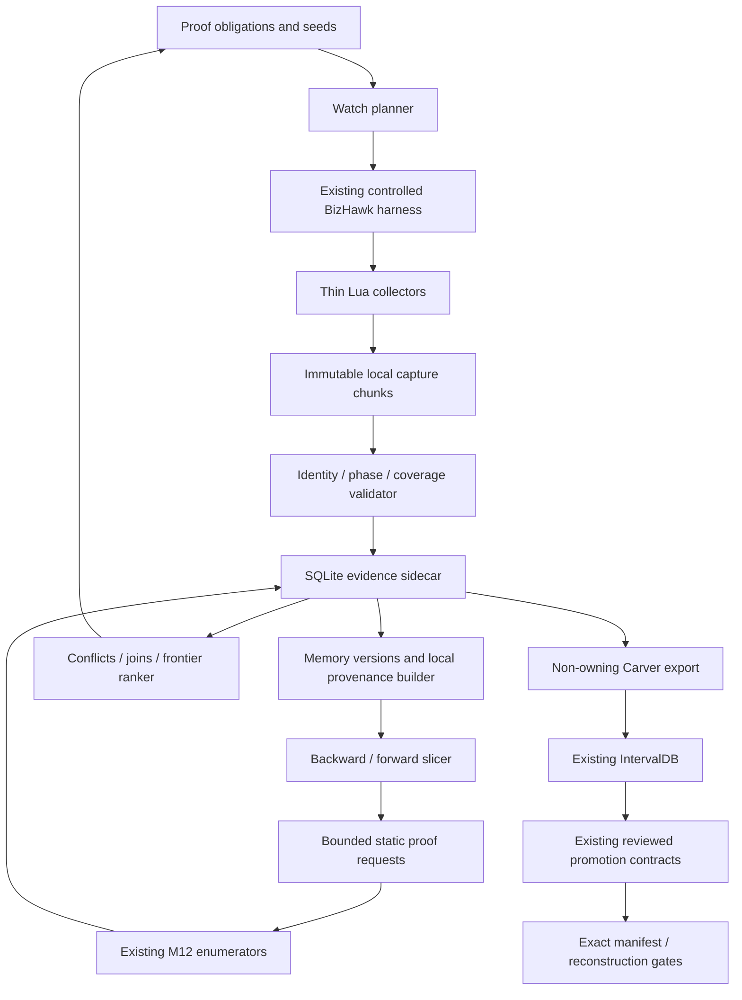

# THOR Evidence Engine — архитектура и acceptance contract

Дата: 2026-09-12. Статус: **DESIGN CONTRACT; V0/V1 НЕ РЕАЛИЗОВАНЫ**.
Базовый checkout: `b886d2507c9010caac2a75ccbb629b809399ffd0`.
Область: developer-only инструменты M12. План этапов:
[THOR_EVIDENCE_ENGINE_STAGES.md](THOR_EVIDENCE_ENGINE_STAGES.md).

## Решение и критическая оценка

**THOR EVIDENCE ENGINE: MODIFY IDEA → BUILD по проверяемым этапам.**

Направление правильное: повторное исследование одних RAM/register зависимостей
нужно заменить постоянным индексом воспроизводимых свидетельств и автоматическим
разрешением конкретных proof obligations. Но «глобальный причинный граф из hooks»
сам по себе ненадёжен. Нужны три раздельных представления:

1. Неизменяемые наблюдения конкретного исполнения.
2. Версии значений и операции, связанные проверенными правилами зависимостей.
3. Обобщённые отношения и утверждения с областью применимости и сертификатами.

Рекомендуемый метод: **demand-driven dynamic slicing + byte-versioned memory SSA
+ bit-precise local expressions + proof-obligation scheduling**. Dynamic taint
служит дешёвым фильтром интереса; taint label сам по себе не объясняет алгоритм
и не является доказательством зависимости каждого помеченного источника.

Один run должен обслуживать несколько совместимых вопросов. Однако «каждый run
обязательно даёт новые edges» невозможно гарантировать. Повторный контроль,
отрицательный результат и корректное доказательство отсутствия наблюдения тоже
полезны. Оптимизируем закрытые обязательства и новые проверяемые отношения на
секунду, а не объём trace или число произвольных узлов.

### Что реально ускорится на пути 46.9% → 100%

Выигрыш ожидается на соединениях code → RAM → code, inherited arguments,
selector domains, повторно используемых consumers и поиске точных входов для
статических перечислителей. Положительный результат может закрыть целое семейство
ROM intervals. Но непосещённые режимы, недостижимые данные, смешанные code/data,
точные границы и физическое представление ресурсов требуют других доказательств.
Не обещаем, что dynamic evidence самостоятельно доведёт карту до 100%.

SOURCE_OWNED — текущая составная метрика manifest, а не процент восстановленных
исполняемых ASM-инструкций. В проверенном manifest `ASM_BYTES=55,514`,
`LOCAL_ROM_DERIVED_ASSET_BYTES=1,085,110`, SOURCE_OWNED — 1,475,368 байт.
Отдельно сохраняются gates ASM_CODE_COMPLETE, ASM_ROM_MAP_COMPLETE,
ASM_REASSEMBLY_BYTE_EXACT и rebuilt-ROM parity; ADR-0043 размещает parity в M13,
систематическую миграцию в C++ — в M14. Этот проект инструмента остаётся в M12.

### Главные риски

| Риск | Ложный вывод | Архитектурное противодействие |
| --- | --- | --- |
| Sparse hooks | «Последний замеченный writer — последний writer» | Пространственно-временной сертификат наблюдения всех релевантных writes |
| Callback phase | callback PC принимается за instruction PC | Независимые поля PC, instance pairing и capability test |
| Склейка адресов | значения разных кадров/arms становятся одной причиной | Epoch и byte/register versions |
| Потеря flags/address/control | источник ROM найден, алгоритм утрачен | Разные роли VALUE, ADDRESS, CONTROL, EXECUTION |
| Taint union | любое попадание метки становится точной причиной | MAY_DEPEND отдельно от проверенного expression |
| Неполный trace | отсутствие события доказывает отсутствие зависимости | Явные GAP, frontier и запрет отрицательных claims без coverage |
| Кэш summaries | старый контракт применяется при новых aliases/IRQ | Preconditions, code generation, footprint и invalidation |
| Самопроверка | импортированная готовая цепочка выдаётся за открытие | Разделить imported canary oracle и engine-derived result |
| Метрика edges | тривиальные edges вытесняют трудные ROM boundaries | Ранжировать proof obligations и marginal useful coverage |

Runtime не доказывает полный CFG, все writers таблицы, её максимальную длину,
неисполнение ROM bytes, отсутствие aliases, семантическое имя, универсальную
input causality, cold-reset происхождение savestate RAM или полную video parity.
Статический анализ также не всеведущ: если входной домен или непрямые переходы
не закрыты, его результат остаётся условным.

## Проверенные точки интеграции

В этой задаче прочитаны текущие исходники и документы, ROM SHA256 проверен
непосредственно. Live emulator capture в рамках этой архитектурной задачи не
выполнялся; runtime факты ниже взяты из указанных отчётов текущего checkout.

| Объект | Проверенный контракт / ограничение |
| --- | --- |
| ROM | 3,145,728; SHA256 `EB19BDA4982366A2FD43D65AB8A7F9709D83A8CC902C14A682C088C16359C263` |
| Текущий manifest | `build/m12-gfxmax-screen-descriptor-candidate-a/materialized/manifest.json`; SHA256 `996ce8100ff8354d682d217b34b7c61bd7e5cad49ec5a4cb5373f69ef76be70b`; 1,475,368 owned / 1,670,360 blob |
| Предыдущий manifest | `build/m12-gfxmax-screen-root-c/materialized/manifest.json` содержит **1,475,346**, на 22 меньше; нельзя выбирать baseline только по похожему имени |
| Harness | `build/bizhawk-controlled-harness/run.ps1` принимает `-LuaScript`; CLI → GEN check → явный Lua state load → hooks → bounded frames → exit |
| State | QuickSave1 SHA256 `7FDE47833CE70A1DF34E75D95C84ED87AFC8470D228AF87967C6BD9DD38B3970`; load 2117, settle 3, window 2120 → 2121 |
| Input | `joypad.set({ Right = true }, 1)`; neutral даёт тот же oracle, zero polls, lagged frame |
| A372 | exec hook PC=A372; write hook может видеть PC=A374 |
| Producer | A342..A438, roots A438/A480; A43A/A482 — aliases root+2 |
| Последние writers | A42A/A430 дают 0030/0006; B000/B006 — 0060/000C; ACE6/ACEC — 0080/0010 |
| DMA | Известен structural join shadow SAT → 27EC → VRAM SAT D000; same-frame publication не доказана |
| Carver | `src/tools/m12_carver.py`: JSON IntervalDB, typed evidence, graph, conflicts, ranking; ownership импортируется из manifest |

Источники проекта: [harness](BIZHAWK_CONTROLLED_HARNESS_DIAGNOSIS.md),
[producer](THOR_M12_A372_SHADOW_SAT_PRODUCER.md),
[writer closure](THOR_M12_SHADOW_SAT_ACCESS_CLOSURE.md),
[negative input control](THOR_M12_CONTROLLED_RUNTIME_ROOT_CAPTURE.md),
[relative consumer](THOR_M12_SELECTOR_RELATIVE_CLOSURE.md).

## A. Component architecture



**Python standard library + sqlite3** для import, queries, provenance и planning;
Lua для capture. На первом этапе нет нового runtime dependency, graph server,
ORM, UI framework, C++ emulator или symbolic executor. C++ capture extension
возможен позже только при измеренном bottleneck или недостающем core hook.
Это отдельный capability stage с cross-check stock core, а не скрытая замена.

Планируемые модули размещаются в `src/tools/thor_evidence/`, Lua — там же в
`capture/`, CLI — `src/tools/re_thor_evidence.py`. Каждый source ≤500 строк.
Желаемые CLI операции: `validate`, `import`, `slice`, `explain`, `diff`, `plan`,
`export-carver`. `explain` обязан показывать raw witness, rule и unresolved
branches, а не только красивый path. Это будущие команды, сейчас их нет.

Граница доверия: capture сообщает события; normalizer проверяет идентичность;
builder применяет версионированную семантику; proof checker устанавливает статус;
scheduler предлагает эксперименты. Ни collector, ни scheduler не назначают
SOURCE_OWNED и не выдают semantic label.

## B. Database schema и identity

SQLite — постоянный индекс, а большие original captures хранятся отдельно в
content-addressed local store. FK включаются на каждом connection; один importer
пишет транзакциями, аналитика читает snapshots. Начать с rollback journal;
WAL нужен только при подтверждённой необходимости одновременно читать и писать
локальную БД. Архивировать через SQLite backup API, не копировать живой DB-файл
отдельно от журнала. Recursive CTE подходят для небольших обходов, большие slices
строить bounded Python worklist. [SQLite FK](https://www.sqlite.org/foreignkeys.html),
[recursive queries](https://www.sqlite.org/lang_with.html),
[WAL](https://www.sqlite.org/wal.html).

Ниже — конкретное реляционное ядро. Это DDL-контракт для прототипа; JSON payload
валидация, типизированные enums и межтабличные semantic invariants принадлежат
import validator. Успешное выполнение DDL не означает готовность движка.

```sql
PRAGMA foreign_keys = ON;
CREATE TABLE artifact (
  hash TEXT PRIMARY KEY CHECK(length(hash)=64), kind TEXT NOT NULL,
  bytes INTEGER NOT NULL CHECK(bytes>=0), locator TEXT NOT NULL,
  retention TEXT NOT NULL
);
CREATE TABLE environment (
  id TEXT PRIMARY KEY, rom_hash TEXT NOT NULL REFERENCES artifact(hash),
  contract_hash TEXT NOT NULL REFERENCES artifact(hash)
);
CREATE TABLE scenario (
  id TEXT PRIMARY KEY, environment_id TEXT NOT NULL REFERENCES environment(id),
  state_hash TEXT NOT NULL REFERENCES artifact(hash), specification TEXT NOT NULL
);
CREATE TABLE trace (
  id TEXT PRIMARY KEY REFERENCES artifact(hash),
  scenario_id TEXT NOT NULL REFERENCES scenario(id), plan_hash TEXT NOT NULL,
  capability_hash TEXT NOT NULL, complete INTEGER NOT NULL CHECK(complete IN (0,1))
);
CREATE TABLE attempt (
  id TEXT PRIMARY KEY, trace_id TEXT REFERENCES trace(id),
  scenario_id TEXT NOT NULL REFERENCES scenario(id),
  status TEXT NOT NULL, host_metadata TEXT NOT NULL
);
CREATE TABLE epoch (
  trace_id TEXT NOT NULL REFERENCES trace(id), number INTEGER NOT NULL,
  start_seq INTEGER NOT NULL, end_seq INTEGER NOT NULL,
  state_digest TEXT NOT NULL, PRIMARY KEY(trace_id,number),
  CHECK(end_seq>=start_seq)
);
CREATE TABLE event (
  id TEXT PRIMARY KEY, trace_id TEXT NOT NULL, epoch_no INTEGER NOT NULL,
  seq INTEGER NOT NULL, frame INTEGER NOT NULL, actor TEXT NOT NULL,
  kind TEXT NOT NULL, phase TEXT NOT NULL, payload TEXT NOT NULL,
  chunk_hash TEXT NOT NULL REFERENCES artifact(hash), chunk_offset INTEGER NOT NULL,
  UNIQUE(trace_id,epoch_no,seq),
  FOREIGN KEY(trace_id,epoch_no) REFERENCES epoch(trace_id,number)
);
CREATE TABLE coverage (
  id TEXT PRIMARY KEY, trace_id TEXT NOT NULL, epoch_no INTEGER NOT NULL,
  space TEXT NOT NULL, start INTEGER NOT NULL, end INTEGER NOT NULL,
  first_seq INTEGER NOT NULL, last_seq INTEGER NOT NULL,
  actors TEXT NOT NULL, access_mask TEXT NOT NULL, guarantee TEXT NOT NULL,
  witness_hash TEXT NOT NULL REFERENCES artifact(hash),
  FOREIGN KEY(trace_id,epoch_no) REFERENCES epoch(trace_id,number),
  CHECK(end>start), CHECK(last_seq>=first_seq)
);
CREATE TABLE entity (
  id TEXT PRIMARY KEY, rom_hash TEXT NOT NULL REFERENCES artifact(hash),
  map_hash TEXT NOT NULL,
  kind TEXT NOT NULL, space TEXT NOT NULL, address INTEGER, extent INTEGER,
  generation TEXT NOT NULL, identity_json TEXT NOT NULL
);
CREATE TABLE value_version (
  id TEXT PRIMARY KEY, entity_id TEXT NOT NULL REFERENCES entity(id),
  event_id TEXT NOT NULL REFERENCES event(id), bit_offset INTEGER NOT NULL,
  bit_width INTEGER NOT NULL CHECK(bit_width>0), value_hex TEXT,
  known_mask_hex TEXT NOT NULL, root_kind TEXT, root_contract TEXT
);
CREATE TABLE operation (
  id TEXT PRIMARY KEY, event_id TEXT NOT NULL REFERENCES event(id),
  opcode TEXT NOT NULL, rule_hash TEXT NOT NULL, expression_json TEXT NOT NULL
);
CREATE TABLE output (
  version_id TEXT PRIMARY KEY REFERENCES value_version(id),
  operation_id TEXT NOT NULL REFERENCES operation(id), output_port TEXT NOT NULL
);
CREATE TABLE dependency (
  operation_id TEXT NOT NULL REFERENCES operation(id), input_port TEXT NOT NULL,
  version_id TEXT NOT NULL REFERENCES value_version(id),
  role TEXT NOT NULL, bit_map TEXT NOT NULL, precision TEXT NOT NULL,
  PRIMARY KEY(operation_id,input_port,version_id,role)
);
CREATE TABLE relation (
  id TEXT PRIMARY KEY, source_id TEXT NOT NULL REFERENCES entity(id),
  target_id TEXT NOT NULL REFERENCES entity(id), kind TEXT NOT NULL,
  context_hash TEXT NOT NULL, contract_hash TEXT NOT NULL,
  UNIQUE(source_id,target_id,kind,context_hash,contract_hash)
);
CREATE TABLE evidence (
  id TEXT PRIMARY KEY, artifact_hash TEXT NOT NULL REFERENCES artifact(hash),
  event_id TEXT REFERENCES event(id), producer_hash TEXT NOT NULL,
  method TEXT NOT NULL, lineage_group TEXT NOT NULL, scope_json TEXT NOT NULL
);
CREATE TABLE relation_evidence (
  relation_id TEXT NOT NULL REFERENCES relation(id),
  evidence_id TEXT NOT NULL REFERENCES evidence(id), stance TEXT NOT NULL,
  PRIMARY KEY(relation_id,evidence_id)
);
CREATE TABLE claim (
  id TEXT PRIMARY KEY, relation_id TEXT REFERENCES relation(id),
  proposition TEXT NOT NULL, scope_json TEXT NOT NULL, status TEXT NOT NULL
);
CREATE TABLE proof (
  id TEXT PRIMARY KEY, claim_id TEXT NOT NULL REFERENCES claim(id),
  checker_hash TEXT NOT NULL, certificate_hash TEXT NOT NULL REFERENCES artifact(hash),
  result TEXT NOT NULL, invalidated_by TEXT REFERENCES evidence(id)
);
CREATE TABLE proof_input (
  proof_id TEXT NOT NULL REFERENCES proof(id),
  evidence_id TEXT NOT NULL REFERENCES evidence(id), PRIMARY KEY(proof_id,evidence_id)
);
CREATE TABLE proof_dependency (
  proof_id TEXT NOT NULL REFERENCES proof(id),
  parent_proof_id TEXT NOT NULL REFERENCES proof(id),
  PRIMARY KEY(proof_id,parent_proof_id), CHECK(proof_id<>parent_proof_id)
);
CREATE TABLE conflict (
  id TEXT PRIMARY KEY, claim_id TEXT NOT NULL REFERENCES claim(id),
  evidence_id TEXT NOT NULL REFERENCES evidence(id), reason TEXT NOT NULL,
  resolution TEXT
);
CREATE TABLE frontier (
  id TEXT PRIMARY KEY, claim_id TEXT NOT NULL REFERENCES claim(id),
  obligation TEXT NOT NULL, required_capability TEXT NOT NULL,
  state TEXT NOT NULL, last_plan_hash TEXT, ranking_json TEXT NOT NULL
);
CREATE TABLE manifest_snapshot (
  hash TEXT PRIMARY KEY REFERENCES artifact(hash),
  rom_hash TEXT NOT NULL REFERENCES artifact(hash), owned_bytes INTEGER NOT NULL
);
CREATE TABLE interval_link (
  manifest_hash TEXT NOT NULL REFERENCES manifest_snapshot(hash),
  start INTEGER NOT NULL, end INTEGER NOT NULL,
  evidence_id TEXT NOT NULL REFERENCES evidence(id), contract_hash TEXT NOT NULL,
  PRIMARY KEY(manifest_hash,start,end,evidence_id), CHECK(end>start)
);
CREATE INDEX event_trace_order ON event(trace_id,epoch_no,seq);
CREATE INDEX versions_entity ON value_version(entity_id,event_id);
CREATE INDEX dependency_reverse ON dependency(version_id,operation_id);
CREATE INDEX relation_incoming ON relation(target_id,kind);
CREATE INDEX coverage_lookup ON coverage(trace_id,epoch_no,space,start,end);
```

### Ключи, дедупликация и жизненный цикл

Все canonical IDs — полный SHA256 versioned canonical JSON: сортировка ключей,
целые числа без float, явные width/endian/domain, UTF-8, без путей и wall time.
При совпавшем hash проверяется canonical payload; несовпадение — hard conflict.
Полный hash хранится в базе; короткий префикс допустим только в интерфейсе.
ROM entities привязаны к image identity, а не к emulator build: для ROM_OFFSET
map_hash — фиксированный hash контракта offset-space. Для RAM/register entities
machine-map contract входит в identity. Environment относится к observation;
cross-environment relation evidence допускается только после проверки
совместимости maps/rules. Validator проверяет соответствие trace ROM/map,
entity domain и value_version epoch, роли зависимостей и отсутствие циклов
в proof_dependency. Это semantic checks поверх DDL, а не свойства одного SQL FK.

- ROM entity: `(rom_sha, ROM_OFFSET, start, end_exclusive, interpretation)`.
- RAM location: `(machine-map-hash, physical-space, offset)`. Raw bus address
  остаётся в событии. Mapping подтверждает mirrors, bank и поколение отображения.
- Instruction: `(ROM hash либо RAM code generation, PC, exact bytes hash, ISA)`.
- Register entity: `(cpu, D0..D7/A0..A7/SR/USP/SSP, bit slice)`; версия всегда
  принадлежит конкретному trace/epoch/event. Equal values не дают equal identity.
- Event: `(trace_content_hash, epoch, seq)`. Hash trace считается после seal;
  временный run token заменяется атомарно и не входит в logical hash.
- Dynamic operation/output: `(event_id, micro_op_index, output_port, rule_hash)`.
- Global relation: endpoints + type + access/transform contract + scoped context;
  список evidence и confidence **не входят** в identity relation.
- TABLE/ROUTINE/RESOURCE — отдельные interpretations над spans с claim;
  не создаются как proven типы лишь из runtime read/PC proximity.
- Constant содержит width/value и источник materialization. Общий interned literal
  не соединяет независимые writers одинакового нуля.

Повторный импорт того же capture — no-op. Новая попытка с byte-identical trace
добавляет attempt/reproducibility result, но не вторую «независимую» причинную
опору. Новое наблюдение существующего отношения дополняет relation_evidence.
Повтор в другом сценарии не обязательно независим по методу: общий emulator,
decoder и исходный artifact отражаются через lineage_group.

Разные watch plans дают разные traces даже на том же state. Объединять их
instance-level зависимости можно только через alignment certificate: одинаковая
исходная идентичность, timeline anchors, наблюдаемые версии/порядок и доказанные
границы отсутствия вмешательства. Одного совпадения frame/PC/value недостаточно.

Операции/versions образуют временной DAG при достаточном порядке событий.
Статические и summary graphs могут иметь циклы; SCC не считается закрытым,
пока его внешние входы и loop-carried зависимости не разрешены.

## C. Event format

V0/V1: UTF-8 JSONL с обязательным header, chunks и seal/footer. Сжать chunks
офлайн стандартным gzip; canonical logical hash считать до compression,
gzip header фиксировать. Не писать SQLite из Lua callback и не flush каждую
строку. Будущий бинарный формат должен декодироваться в тот же event schema;
переход допустим после профиля parse/serialization cost.

Пример ниже **иллюстративный**, не новый runtime capture. Placeholders запрещены
в настоящем importer. `instruction_pc` может остаться null до проверенного pairing.

```json
{
  "schema": "thor.evidence.event.v1",
  "epoch": 1,
  "seq": 42,
  "frame": 2120,
  "actor": "M68K",
  "kind": "BUS_WRITE",
  "phase": "CALLBACK_RAW",
  "callback_pc": "0x00A374",
  "instruction_pc": null,
  "instruction_instance": null,
  "space": "M68K_BUS",
  "address": "0xFF13CC",
  "width_bytes": null,
  "value_hex": "00880901",
  "before_hex": null,
  "after_hex": null,
  "capability_ref": "<validated-callback-contract>",
  "coverage_ref": "<spatial-temporal-coverage-certificate>"
}
```

Нельзя угадать width по длине напечатанного value. Raw callback остаётся
неизменным; derived event со ссылкой на него может получить width=4,
instruction=A372 и normalized memory value после exec/decode/phase validation.
Отсутствующий before не заменять нулём или bus peek после операции.

Header: ROM/core/build/config/map/state/scenario/watch/capture-script/schema
hashes, capabilities, initial epoch, frame window и declared actors.
Event envelope: seq, actor, frame, optional cycles с clock domain, phase, callback
source; payload конкретного типа. Локальная observer sequence задаёт порядок
callbacks, но не выдаётся за hardware bus cycle order.

Типы: EPOCH_BEGIN/END, EXEC_BOUNDARY, BUS_READ/WRITE, REGISTER_SAMPLE,
INPUT_SET/POLL/LATCH, DMA_PROGRAMMED/START/TRANSFER/COMPLETE,
VDP_WRITE, SNAPSHOT, WATCH_BEGIN/END, GAP и RUN_END.
BUS_READ содержит фактический callback read value только при проверенной
семантике. Debugger peek маркируется OBSERVER_PEEK и не считается CPU read.
Register samples являются только якорями; они не доказывают отсутствие
промежуточных изменений.

Footer: counts по collector, last seq, chunk lengths/hashes, event drops,
watch activation boundaries, termination reason, final state observations.
Обрезанный файл quarantined; уже sealed prefixes сохраняют observations,
но не дают window-complete claims. Unknown schema/phase fail closed.

## D. Provenance model для 68000

### Memory SSA и временная полнота

Last-writer map индексирует **байты физической памяти**, не word-address.
Запись longword в FF188A создаёт версии FF188A..FF188D и меняет provenance
FF188C. Чтение word собирает две версии в big-endian порядке. Любая запись,
включая запись прежнего значения, создаёт новую версию.

Перед окном tracked RAM и registers получают `EXTERNAL_STATE` versions,
связанные с точным state/anchor digest. Это terminal лишь относительно
обозначенной границы, не доказанная история до savestate. Для запроса «до ROM»
та же вершина дополнительно создаёт frontier `PRE_CAPTURE_ORIGIN`.

Верный last-writer требует всех writers tracked bytes от anchor до read,
включая aliases, overlapping starts, IRQ и разрешённые другие actors.
Если callback-фильтр совпадает лишь с началом доступа, planner расширяет
watch starts до пересекающихся byte/word/long writes и проверяет wrap/mapping.
Неизвестная полнота hook означает `LAST_OBSERVED_WRITER`, не `LAST_WRITER_PROVEN`.
Согласованные начальный/конечный snapshots не исключают пропущенную запись.

### Инструкции как маленькие точные выражения

Execution graph хранит operation с ordered operand ports, widths, output
bit mappings и concrete values. Union taint используется только для отбора
интересных operations; точный backward slice проходит expression DAG.

| Форма | Обязательная семантика provenance |
| --- | --- |
| MOVE.B/W в Dn | Новые low bits + сохранённые upper bits; не overwrite всего Dn |
| MOVEA.W / ADDA.W | Sign extension; address arithmetic отличается от MOVE/ADD data |
| MOVEQ / CLR / literal | Константные bits получают materialization root; не наследуют старый taint |
| LEA | ADDRESS expression; не выдумывать чтение содержимого памяти |
| ADD/SUB | Bit-vector result и carry dependencies; flags отдельными outputs |
| AND/OR immediate | Mask удаляет не влияющие bits; сохраняется операция с exact operands |
| CMP/TST/Bcc | SR/CCR versions → predicate → observed branch; value и control разные роли |
| DBcc | Условие + low-word decrement/counter; loop instance не общий PC |
| Memory modes | Predecrement/postincrement как outputs; PC-relative base по exact decode |
| MOVEM / stack / exceptions | Порядок transfer, active A7 bank и return kind; без поддержки — frontier |

Проверять ISA именно MC68000, не переносить правила 68020. Для реализации форм
использовать [Motorola/NXP programmer reference](https://www.nxp.jp/docs/en/reference-manual/M68000PRM.pdf)
и independent instruction fixtures. SR включает не только арифметические flags;
IRQ/exception/USP/SSP границы нельзя незаметно считать обычным call/return.

Первый обязательный expression canary:

```text
selector := byte[FF1858]                 # control root, may be EXTERNAL_STATE
root := (selector == 0 ? A438 : A480)    # observed branch + static alternative
offset := sign_extend16(word[FF188C])
destination := FF13CC + offset
old_counter := word[FF188A]
record := ROM.long[root + 8*i]
new_counter.low8 := (old_counter.low8 + 1) & FF
D2 := (record & FFFFFF00) | new_counter.low8
RAM.long[destination] := D2              # A372
```

First-record value `00880901` должен иметь раздельные источники high24 и low8,
address dependency от offset и control dependency от selector. Low8 исходного
ROM longword перезаписан: он не должен попасть в точный value slice результата.
Полный SAT record дополнительно использует +4/+6 и FF185A; gates FF184F,
FF1856/FF1855 нельзя забывать при расширении запроса на всю routine. Их
неполная история оформляется frontier, а не отбрасывается.

Unsupported opcode, unpaired event, missing register definition или неполный
memory effect переводят затронутые outputs в UNKNOWN_TRANSFORM. Известный
concrete value сохраняется, но происхождение не наследуется от старого значения.
Если footprint неизвестен, инвалидировать весь потенциально затронутый tracked
state; продолжить только после нового anchor/certified boundary.

Контроль потока: до статического CFG/postdominator certificate хранить
`PATH_PREDICATE_CONTEXT`, не универсальный CONTROL_DEPENDS. Наблюдение выбранной
ветки не доказывает, что альтернативный input изменит output. Forward slice
показывает только consumers в покрытом окне, с `FUTURE_CONSUMERS_UNOBSERVED` на
его конце. Это не полный список всех будущих readers ROM range.

### Почему sparse capture требует replay

На первом run найден read R, но его writer случился до включения watch. Его
нельзя восстановить задним числом по текущей RAM. Сохранить frontier, повторить
тот же deterministic scenario с watch активным раньше, либо использовать ранее
сохранённое достаточное локальное окно. То же относится к register chains.

Вместо постоянного full CPU trace: bounded dense instruction window от
проверенного routine entry до exit + sparse write watches tracked memory на
всём relevant prefix. Для общего RAM seed без entry contract потребуется
разведочный проход, затем focused replay. «Произвольный seed» означает поддержку
типов запросов, а не гарантию полного ответа за единственный запуск.

## E. Capture model и hardware

Logical collectors разделяют одну event sequence и watch registry. План
объединяет overlapping watches и совместимые окна, а per-collector events
ссылаются на общий instruction instance. Не создавать семь независимых clocks.

| Collector | Данные | Условие вывода |
| --- | --- | --- |
| Execution/call | exact PC/bytes, anchors, targets, return address | CALL/RETURN выводятся из decoded instruction и stack evidence; JMP не CALL |
| RAM | watched reads/writes, width, values, versions | Last-writer только с coverage certificate |
| Registers | boundary snapshot + нужные deltas/operands | Полный участок definitions либо explicit unknown |
| ROM | data reads, mapping, address expression | Fetch code и read data различаются; ROM_OFFSET не raw bus address |
| Resource | call instance, args, return, consumed/written intervals | Вход source/dest не доказывает size/termination |
| DMA/VDP | register programming, trigger, source, dest, transfer/visibility | Отделять queued source, transfer и доступное VDP содержимое |
| Input/state | explicit controls, poll/latch, epoch, frame/lag | INPUT_SET не равен game INPUT_READ |

Для 0x3820 сначала сохранить CALL_CONTRACT_OBSERVATION с entry/exit и spans.
Exact compressed → decoded dependency требует проверенного decoder model,
реально consumed token ranges и истории backreferences/output bytes. Нельзя
пометить каждый output всем compressed ROM: это MAY_DEPEND_SUMMARY. Подробный
token DAG включать только для selected output slice; сохранённая bounded
recipe должна позволять его восстановить. Начальный dictionary/preset тоже
root. Отсутствующий return или ранний выход не становится complete resource.

DMA consumer берёт source byte versions **на момент transfer**, не на момент
подготовки очереди. Иначе intervening writes дают ложную связь. Модель обязана
различать memory DMA, fill и VRAM copy, auto-increment, destination wrapping,
CRAM/VSRAM/VRAM и MMIO command state. Поддержать сначала один доказанный режим;
остальные — UNSUPPORTED_DMA_MODE. Address D000 интерпретируется как SAT только
при подтверждённой конфигурации VDP table base. Сам SAT ещё не pixels: нужны
pattern data, palette, priority, scroll и состояние renderer.

Работающий Lua harness не доказывает доступность всех перечисленных hooks.
V0 capability matrix отдельно проверяет read/write width, overlap, instruction
phase, IRQ interleaving, DMA visibility и debugger-peek behavior. Если hook
DMA отсутствует, permissible result — structural join + visibility frontier.
Не заменять отсутствующее событие совпадением buffers в двух кадрах.

## F. Static/dynamic merge и graph joins

Static request — конкретное обязательство:
`consumer entry/code hash + observed effective addresses + required domain +
candidate span + proof question + budget`. Reuse existing exact decoder/IR,
`m12_a372_shadow_sat_producer.py`, `m12_shadow_sat_access_graph.py`,
`m12_selector_control_analysis.py`, `m12_relative_table_analysis.py`,
`m12_selector_descriptor_grammar.py` и Carver adapters.

Static certificate содержит exact bytes identity, trusted entry evidence,
assumptions, CFG closure, loop/selector bound, stride/field grammar, all relevant
aliases/writers or explicit domain exclusions, physical start/end и checker
version. Отдельные claims: STRUCTURE, DOMAIN, BOUNDARY, PHYSICAL_REPRESENTATION,
SEMANTIC_LABEL. Успех одного не делает остальные подтверждёнными.

Dynamic observation связывается с static claim через exact instruction/entity
и удовлетворение assumptions. Оно может подтвердить witness существования
или опровергнуть слишком широкий static claim; конечная выборка не усиливает
scope до «всегда». Imported reports сохраняют исходный scope: census direct
absolute references в decoded input не становится all-ROM/all-alias proof.

Три класса joins:

1. **Instance join:** разные seeds приводят к одной byte/register version
   в одном trace/epoch. Можно безопасно объединить query traversal.
2. **Entity join:** разные observations касаются одного ROM span/location.
   Это общий объект, но ещё не одна причинная история.
3. **Contract join:** совпадает проверенный parameterized summary при доказанных
   preconditions/footprint. Повторную внутреннюю детализацию можно не запускать.

Hash-consing expressions экономит DAG storage, но общая formula не склеивает
разные dynamic outputs. Summary хранит input ports, outputs, control assumptions,
alias footprint, code/mapping generation, precision, proof и witness recipe.
Новый output, другая ветка, input domain или changed dependency требуют
переоткрытия summary. Semantics-neutral common subgraph может быть subsystem
candidate, но название и boundary подсистемы требуют отдельного решения.

## G. Terminal roots и frontier scheduler

Terminal определяется типом вопроса и boundary contract, не значением адреса.

| Root | Минимальное evidence |
| --- | --- |
| ROM_DATA | exact ROM hash, resolved mapping/range, фактический read либо static checked operand |
| ROM_CODE_CONSTANT | exact instruction и operand/materialization bits |
| INPUT | documented latch/read event и linkage к установленным controls |
| HARDWARE | observed device event + модель и scope; неизвестный internal source остаётся boundary |
| RESET_INITIALIZATION | witnessed initializer/reset contract; ноль в state недостаточен |
| EXTERNAL_STATE | exact state/anchor и location/version; происхождение до anchor неизвестно |
| UNRESOLVED | отсутствующее обязательство, reason, affected outputs, next evidence method |

Запрос явно выбирает relevance: VALUE, ADDRESS, CONTROL, EXECUTION и границы
ROM/hardware/time. Для «алгоритм до SAT» default включает все четыре роли.
UNRESOLVED — frontier, а не proven terminal. Итоги различаются:
`CLOSED_WITHIN_SCOPE`, `EXPLAINED_WITH_FRONTIERS`, `CONFLICT`, `INCOMPLETE_CAPTURE`.
Список сохранённых unresolved делает отчёт честным, но не делает graph закрытым.

Frontier key: missing proposition + scope + input entity versions/contract +
required evidence class. Хранить prerequisite DAG, last attempt, blockers,
expected downstream reuse, candidate intervals, cost и cooldown.

Первый scheduler детерминированный. Неподдерживаемые capabilities и violated
STOP gates отсеиваются до ранжирования. Предлагаемая эвристика, **не измеренная
энтропия и не calibrated probability**:

```text
gain = 5*closed_obligations + 3*reusable_joins + 2*new_contract_witnesses
       + 2*log2(1 + marginal_eligible_unknown_bytes/256) + conflict_resolution
score = reachability_estimate * gain / (1 + measured_or_estimated_seconds)
        - repeated_no_gain_penalty - capture_risk_penalty
```

Weights/config фиксируются hash; estimates/rationale показываются в plan.
Не суммировать один ROM interval по нескольким frontier; считать marginal
union, не размер всего UNKNOWN gap. Непроверенные оценки отдельно от результатов.
Разрешение validity conflict имеет приоритет над зависимыми расширениями.
Выделить до 10% bounded бюджета на непохожие доступные frontiers, чтобы локальный
SAT cluster не поглотил всё исследование. Stable tie-break: frontier_id.

На текущем state neutral/Right уже эквивалентны в известном окне: повторный Right
имеет нулевой novelty estimate. 03BDA6/03BDD8 требует **нового класса evidence**,
например реально выбранного index/cursor/lifetime и consumer stop condition.
Повтор поиска sentinel до BF86, продление по соседству или повтор прежней
статической grammar не закрывают blocker. Если нужное состояние не достигнуто,
не подменять исследование произвольной RAM-инъекцией.

## H. Multi-scenario strategy

Сначала надёжный процесс на arm через существующий runner. Позже один EmuHawk
процесс может загрузить тот же state несколько раз, но каждый restore создаёт
новый epoch и сбрасывает Lua last-writer map, taint, call stack, VDP shadow,
input state, counters и pending operations. Savestate.load не сбрасывает Lua
переменные. Hooks либо переустанавливаются, либо проверяются на единственность.

Scenario identity = state hash + settling input timeline + measured window +
controller/movie configuration + trigger + reset policy. Attempt identity
отдельная; wall time не входит в deterministic identity.

Порядок выбора: neutral baseline → exact neutral repeat → один мотивированный
input arm, только если достижим poll/latch. Далее N-frame variants с минимальным
увеличением окна и отдельным бюджетом. Не запускать Cartesian product всех
кнопок/длительностей. A/B/C/направления — кандидаты, не обязательные восемь arms.

Корпус минимизируется weighted set cover по новым obligations, relation
contracts, dispatch targets и root classes. Сохранять shortest cheap scenario,
но не удалять raw evidence, на которое опираются proofs. Near-duplicate traces
нужны для reproducibility, а не как новые открытия.

Differ сравнивает scoped relations, expressions и boundaries, а не event seq
при различной длине path. `RIGHT_ONLY` означает «наблюдалось только в Right arm
при сопоставимом coverage»; если neutral не покрывал этот window — UNKNOWN.
`COMMON` не означает input independence на других состояниях. Causal claim
требует checked intervention, фактического потребления input и достаточной
dependency chain; минимум neutral→Right→neutral controls с reset identity.

## I. Conflict/confidence model

Одного confidence score недостаточно. Хранить status claim и независимые оси:
source integrity, event validity, derivation precision, temporal coverage,
domain completeness, reproduction и independence lineage.

- CANDIDATE: hypothesis; пригодна для planning, не для proof/promotion.
- OBSERVED: валидное событие/экзистенциальное отношение в конкретном scope.
- CONFIRMED: проверенное derivation/contract с certificate в указанном scope.
- PROVEN: пользовательский alias CONFIRMED; нельзя иметь два неясных уровня.
- UNRESOLVED: не выполнено конкретное proof obligation.
- CONFLICT: несовместимые утверждения об одном scope; dependent promotion blocked.

«Прочитан X» может быть CONFIRMED observation, а «X — полная animation table»
одновременно UNRESOLVED. Отсутствие совпадения между сценариями не conflict,
если различаются preconditions. Настоящий конфликт не решается большинством
повторных runs: invalidated proof и зависимые summaries пересчитываются по
reverse proof_input и proof_dependency links. Оригинальные evidence не удаляются.

## J. Performance / trace reduction

Два режима: дешёвые discovery probes и dense capture только selected windows.
Перед run вычислить static predecessor candidates и closure watches до known
boundary. Упаковать несколько вопросов с общими probes в один plan; если union
слишком дорогой, разделить по окнам/actor, а не включать все collectors навсегда.

Сохранять register entry snapshot + необходимые operands/deltas, byte versions
для watched RAM, execution dictionary и occurrence stream. Runs/loops сжимаются
только losslessly: instance order и link к input/output versions сохраняются.
Sequence «запись того же значения» нельзя удалять. Heavy blobs не помещать в
каждый edge; применять artifact refs. Bit expressions interned, root sets
materialize по запросу. Coarse taint saturation порождает frontier, не тихое
усечение источников.

Стартовые **предлагаемые пределы**, не результаты benchmark:

| Профиль | Лимит |
| --- | --- |
| Canary arm | 3 settle + 1 measured frame, ≤30 s wall, ≤250,000 events, ≤64 MiB raw |
| Watch plan V1 | ≤64 exec sites + ≤64 normalized memory intervals; dense selected region допускается в event cap |
| Lua buffering | ≤4 MiB, bounded chunk flush; counts включают discarded events |
| Import | 1,000,000 synthetic events ≤60 s, peak RSS ≤1 GiB, batch ≤10,000 events |
| Slice | ≤100,000 operations, ≤5 s на fixture DB с 1M events; larger result explicit budget frontier |
| Measured emulation overhead | Цель ≤10x uninstrumented measured window, startup исключён; V0 должен измерить реальность |
| Initial campaign | ≤8 arms, ≤256 MiB raw, ≤120 s, не более двух одинаковых no-gain attempts |

Любой hard cap останавливает/закрывает capture с BUDGET_EXCEEDED. Нельзя сохранить
complete=true после drops. Если callback rate сам дорог, отключение записи
строк недостаточно: уменьшить installed watches/окно. Native ring buffer имеет
смысл только после такого измерения. Метрики скорости считать на описанной
машине/версии, сохранять startup/capture/import отдельно.

## K. Determinism / reproducibility contract

Run manifest фиксирует ROM SHA256/size, state hash, emulator executable и core
binary hashes, version/tag, config/sync settings, region, controller, memory map,
Lua/decoder/rules/checker hashes, watch plan, schema и host runtime versions.
Также фиксировать movie/autofire/cheats/rewind, persistent RAM и внешние вводы:
выключить либо изолировать и включить в identity. ROM/state оригиналы не менять.

Проверенный harness остаётся entrypoint: отдельная конфигурация, SingleInstance
off, Lua explicit load, known frame assertions, bounded exit с exact PID.
Изменения инфраструктуры сначала проходят прежний oracle. Диагностические
script paths сейчас ignored/local; для воспроизводимости на другой машине V0
должен либо требовать их точный hash как prerequisite, либо вынести проверенную
логику в parameterized payload-free tracked launcher, сохранив baseline script.
Абсолютные private paths не включать в logical hashes/public artifacts.

Детерминированность имеет три независимых результата:
`INPUT_STATE_IDENTITY`, `CANONICAL_EVENT_REPLAY`, `ANALYSIS_REBUILD`.
Raw bytes compressed file и SQLite page layout не обязаны совпадать; сравнивать
canonical event stream и sorted logical export. Не удалять при нормализации
hardware values, relative timing/order или nondeterministic events ради hash match.

Два cold process repeats и neutral control — минимальный canary. Проверить
также instrumented versus existing baseline наблюдаемые конечные RAM/register/
VDP digests в доступной области. Совпадение этих checkpoints — bounded
non-interference evidence, не full runtime parity и не сравнение физических
консолей. Same-process multi-arm требует A→B→A isolation test.

При расхождении выводить FIRST_DIVERGENCE: scope, first event/anchor, expected,
actual и capability/rule versions. Пустой trace с совпавшим hash не PASS.
Сначала reject integrity/coverage, затем сравнивать behavior.

## L. Test strategy и обязательный canary

Oracle — заранее зафиксированная machine-readable спецификация **ожидаемых
отношений**, построенная из текущих ручных доказательств. Engine не читает
готовые edges oracle при построении результата. Imported evidence отображается
отдельно; совпадение import с самим собой не засчитывается discovery.

V1 должен автоматически получить minimum graph, а не A372←UNKNOWN:

1. Entry A342, наблюдённый caller и A372 write attribution, не A374 writer.
2. FF1858 predicate → выбранный A438; alternate A480 только STATIC,
   пока эта ветка не наблюдалась. No semantic animation label.
3. ROM record high24 + updated D5.low8 → D2 → конкретная FF13CC version.
4. FF188C → sign extension → A5 destination; FF188A → counter update.
5. Writes A42A/A430, B000/B006, ACE6/ACEC с temporal order и final 0080/0010.
6. Read/write coverage достаточное для заявленных last writers;
   overlapping longword FF188A fixture не теряет FF188C dependency.
7. Structural DMA join импортируется с меткой STATIC/IMPORTED. Dynamic
   same-frame DMA/VRAM/pixel path до отдельного hardware gate остаётся frontier.
8. Neutral/Right identical known path; zero input polls исключает causal input edge.

Метрика canary: 100% заранее перечисленных обязательных positive relations,
0 forbidden claims, проверяемый raw witness/rule для каждого derived edge.
Не требовать минимальное число edges, которое можно набрать их дроблением.
Unknown precapture roots разрешены только в явном allowlist contract; missing
core high24/low8/address chain не разрешён. Known optional branches остаются
unobserved, не «покрыты» default arm.

Проверки: hand-authored synthetic 68000 programs/fixtures без ROM payload;
known-value vectors + независимые core observations; truncation, bad hashes,
reordered callbacks, read-start/overlap, same-value writes, unknown opcode,
restore epochs, missed IRQ writer, flags, DMA queued-versus-transfer race.
Compare imported/manual oracle отдельно от generated graph. Для масштабирования
использовать held-out seed B730 или 03BDD8: новые chains не зашивать в collector.

## M. Failure modes и действия

| Ситуация | Обязательный результат |
| --- | --- |
| Неизвестная phase/width | RAW_OBSERVATION_ONLY; запрет guessed PC subtraction |
| Writer вне watch window | PRE_CAPTURE_ORIGIN / WATCH_GAP; focused replay proposal |
| Hook пропустил alias/IRQ | Invalidate affected versions и dependent proofs |
| Failed opcode semantics | UNKNOWN_TRANSFORM; сохранить values, не invent dependency |
| Начальный VDP command latch неизвестен | DMA/VDP frontier; никакого reconstructed transfer |
| Two scenarios share RAM address | Entity join only; causal splice запрещён |
| Savestate restore оставил Lua state | Reject epoch; A→B→A isolation regression |
| Нет poll в input arm | Input installed observation, causal claim unresolved |
| Relative stream достиг BF86 без terminator | EXTENT_UNRESOLVED; не поглощать code |
| Дубликат evidence разным producer path | Общая artifact lineage; не independent proof |
| Диск/timeout/trace cap | Quarantine incomplete suffix; no complete-window certificate |
| Artifact удалён/изменён | PROOF_NOT_REPLAYABLE/CONFLICT; вернуть зависимые obligations |
| Summary применён вне domain | Reject reuse; expand original recipe либо frontier |
| No marginal gain | Memoize negative result; stop/re-rank, не endless capture |
| Source-owned count вырос от import | Hard fail; bug в интеграции, не прогресс RE |

## N. Integration with M12 и измерение результата

Carver сохраняется владельцем interval partition и существующей формы отчётов.
SQLite sidecar нужен для event identity/SSA, которых текущая JSON модель не
выражает. В `IntervalDB.add_edge` нынешний ID включает evidence list; это
неподходящая identity для постоянного accumulating relation. Не менять его
поведение массово: exporter формирует один deterministic aggregate evidence
record на relation и каждый раз строит свежий Carver view из frozen manifest.
Carver IDs считаются локальными output IDs; стабильные TEE IDs лежат в details.

`IntervalDB.add_evidence` проверяет ROM bounds; RAM/VRAM ranges нельзя отправлять
туда как start/end. Весь dynamic graph остаётся в sidecar, а ROM-linked evidence
экспортируется по `(ROM SHA, start, end, manifest snapshot)` с graph references.
Отдельные interpretations перекрывающихся структур не меняют partition.
Join с manifest делается по пересечению диапазонов и exact ownership contract,
не по mutable manifest index. Baseline selection — явный path+hash+count.

SOURCE_OWNED workflow:

```text
validated observation → scoped derivation → static obligation
→ independently checked domain/boundary/representation certificate
→ non-owning Carver evidence → existing promotion dry-run
→ exact transaction and existing reconstruction validation
→ explicit promotion result → new manifest snapshot
```

TEE не имеет автоматического write API к manifest. После dry-run действует
существующий promoter workflow; неизвестные bytes не превращаются в dc.b
ради процента. Fallback materialization и успешная полная assembly — разные
результаты. Этот distinction особенно нужен для текущих исторических M12
артефактов, где отчёт screen-root-c содержит assembly fallback.

Каждый campaign report показывает отдельно:

- Capture cost, events/bytes, coverage gaps и replay identity.
- Новые уникальные scoped relations и validated derivations, lineage разнообразие.
- Закрытые obligations, root classes, unresolved branch ratio и revoked claims.
- Useful joins и повторно использованные contracts, экономию actual reruns.
- Exact statically bounded bytes, eligibility и blocking conflicts.
- SOURCE_OWNED delta исключительно из выполненных existing transactions;
  ASM_BYTES, blob bytes, exact reconstruction и runtime parity отдельными полями.

До/после сопоставлять одинаковые seed/obligation sets и одинаковый бюджет.
Большой graph с нулём новых closed obligations — отсутствие доказанного
ускорения. Маленький graph, снявший общий blocker семейства, — полезный результат.
100% ownership без faithful representation/executable classification остаётся
недостаточным для цели полной ASM реконструкции.

## Что адаптировать из существующих методов

Из dynamic taint взять explicit policies и различие data/address/control
dependencies; из slicing — backward demand и worklist over definitions; из
symbolic execution — маленькие bit-vector expressions, только если они нужны
для bounded selector domain. Pointer taint и implicit flows требуют явной
политики; taint не является точным решателем причинности.
[Schwartz, Avgerinos, Brumley](https://users.ece.cmu.edu/~aavgerin/papers/Oakland10.pdf).

Из PANDA взять повторяемое исполнение с разными offline analyses и immutable
recording identity. Не переносить PANDA/QEMU в проект и не заявлять, что
savestate+input уже является полноценным nondeterministic record/replay:
достаточность этого контракта проверяется на выбранном BizHawk core.
[PANDA](https://github.com/panda-re/panda).

Из AFL++ взять novelty-guided corpus, context-sensitive coverage и минимизацию
inputs/scenarios. Приоритет здесь у evidence obligations; PC coverage лишь
reachability signal. Blind fuzzing controls и probabilistic coverage bitmap
не годятся в качестве proof identity. Это архитектурная адаптация методов,
не установка AFL++ для Genesis. [AFL++](https://aflplus.plus/docs/afl-fuzz_approach/),
[instrumentation features](https://aflplus.plus/docs/features/).

Concolic extension отложить до V8: только небольшой verified RAM-only slice,
bounded instruction count, finite input variables и solver timeout. Solver
model — предложение scenario, подтверждаемое реальным replay. Unknown hardware,
indirect memory или unsupported instruction останавливают solve. Полный symbolic
68000 executor создаст отдельный большой проект раньше полезного M12 результата.

### Что заменить или исключить

- Заменить «один узел на адрес/значение» на entities + temporal versions.
- Заменить seven always-on collectors на единый budgeted watch plan.
- Заменить безусловный union taint на coarse interest filter + exact local DAG.
- Заменить «повтор = независимое evidence» на attempts + lineage accounting.
- Заменить «terminal = ROM» на query-scoped roots и honest frontiers.
- Заменить автоматическое promotion по runtime на проверяемые proof obligations.
- Исключить Neo4j/server/UI, all-ROM tracing и общий symbolic executor из V0/V1.
- Передвинуть минимальную RAM/register семантику **до** canary: иначе V1
  получится демонстрацией hooks, а его основной критерий останется на V3.

Архитектура готова для bounded V0; построение V1 зависит от измеренной
capability matrix и canary micro-semantics. В этой задаче фиксируются документы
и проверяется согласованность контракта. Ни emulator run, ни новый runtime
graph, ни ownership promotion не выдаются за выполненные.
