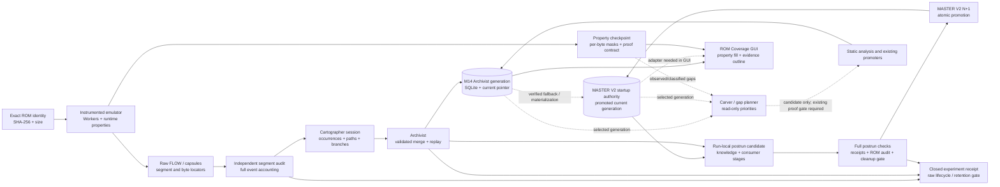

# ROM Evidence System — Global Scheme

Date: 2026-09-27

Status: architecture synthesis of existing developer-only evidence systems. This
report is read-only analysis; it does not replace the active native-game roadmap,
change a proof contract, or authorize new classifiers or canonical promotions.

## Finding

The project already has the main parts of a cumulative ROM evidence system, but
they answer different questions and are spread across distinct data products.
They can share one ROM identity and a linked generation lineage while
retaining separate pointer schemas and truth domains:

1. The **property bitmap** answers which byte properties have been established
   for each ROM byte under a specific runtime build and proof contract.
2. **Worker captures and Cartographer graphs** preserve runtime occurrences,
   ordered CPU paths, branches, windows and provenance. They are evidence
   producers and session stores, not ROM ownership maps.
3. **Canonical knowledge** is the persistent, versioned map of ROM ranges,
   objects, claims, relations, evidence references and conflicts. M14 Archivist
   publishes a hash-bound SQLite generation. The newer local Worker runtime
   path materializes a run-local postrun generation from MASTER V2, then
   promotes a validated N+1 generation to the MASTER V2 startup pointer. These
   pointer formats are connected by explicit import/materialization code, not
   interchangeable files.
4. **Carver** joins known reports and ranks unknown gaps and blockers. Its
   existing runs are advisory snapshots, not a second ownership authority.
5. **ROM Coverage GUI** is a read-only projection: property colors show byte
   masks; outlines show canonical evidence status; range details can expose
   provenance. The GUI does not merge or promote data.

The “3D map” idea is best represented by linked dimensions in this evidence
model: ROM address, semantic object/consumer, runtime occurrence/time, and proof
status. The current map is a graph plus ROM ranges, not a literal 3D renderer.

## Current components and evidence boundaries

| Component | What it stores or computes | What it does not prove |
| --- | --- | --- |
| ROM property checkpoint | Per-byte property masks; exact ROM SHA/size, schema, contract hash, core build ID, run ID, capabilities, checkpoint generation and validation state | A property mask does not identify a character or resource unless its contract says so; total coverage is not the sum of overlapping properties |
| Worker capture | Worker/capture/segment identity, native events and source locators; raw record envelopes preserve fields and replay identity | A segment or worker finishing does not make every observation semantically proven or make a capture complete |
| Cartographer/session graph | Structural CPU/register/resource nodes and edges plus occurrence witnesses, ordered paths, branches and capture windows | Structural graph reuse does not mean runtime occurrences are duplicates; observed paths do not prove whole-game reachability |
| M14 Archivist publisher | Audited session ingestion, parent-bound SQLite generation, hashes, independent audit and atomic Archivist `current.json` | Runtime evidence does not promote `SOURCE_OWNED`; this pointer is not the MASTER V2 startup pointer |
| MASTER V2 startup authority | Integrated canonical-map and knowledge sections, exact ROM identity, accumulated run ledger and atomic N+1 publication after postrun acceptance | A run-local postrun pointer is only a candidate; it is not the promoted current authority |
| Canonical knowledge view | ROM-addressed objects, typed claims/relations, evidence references, hypotheses and conflicts under an identified generation | A knowledge claim does not automatically set a property bitmap bit or close source ownership |
| Carver / gap reports | Unknown-range families, consumer ancestry, blockers, conflicts and ranked follow-up candidates | An empty queue/fixed point only means that its supplied evidence adapters found no more work; it does not prove all ROM semantics are known |
| Coverage GUI | Read-only property bitmap plus independently colored canonical evidence overlay | The GUI is not a producer, canonical writer, promotion engine or proof validator |

These separations follow existing checks: repeated Worker windows are deduped
by native occurrence identity but retain window witnesses; runtime paths preserve
repetitions and alternate tails; static ownership remains emission/promoter
derived; raw retention requires a closed receipt and replay rather than a
matching hash alone.

## One logical flow

Solid arrows describe established producers or read paths. The M14-to-MASTER
fallback/materialization and postrun promotion are implemented in the inspected
runtime branch. The dashed MASTER V2-to-GUI edge is still an integration gap:
the current evidence-overlay adapter reads the M14 pointer schema only. Dashed
Carver inputs and candidate feedback are the recommended contract: consume a
specific accepted generation and checkpoint, emit ranked proposals with source
identities, and leave promotion to existing proof-gated tools.

## Identity envelope for a joined view

A joined result needs all of these identities; ROM SHA alone is necessary but
not sufficient for comparing runs or accepting a property proof:

- **ROM:** SHA-256 and byte size.
- **Property evidence:** property schema, proof-contract SHA-256, runtime/core
  build ID, run ID, capability bits, validation state and checkpoint checksum.
- **Capture evidence:** format/version, capture and segment IDs, Worker/window
  lineage, source artifact hashes and complete accepted/duplicate/unresolved/
  rejected event accounting.
- **Session graph:** schema version, session/master graph hash, occurrence
  identity contract and path/capture-window boundaries.
- **Canonical generation:** pointer schema, parent and current generation IDs,
  ROM identity, database/master SHA-256, logical map/evidence/emission and section
  hashes, audit/merge/promotion receipt, and the exact current pointer. Keep M14
  Archivist and MASTER V2 pointer identities separately visible.
- **View:** selected checkpoint identity plus selected canonical generation.
  The UI must state both selections and fail closed on ROM mismatch.

This prevents a common error in the project: using “canonical” for two different
objects. The GUI can have a canonical **property union** checkpoint and a
canonical **knowledge generation** at the same time. They are separate inputs
and must not silently inherit each other's baseline or status.

## What already combines cleanly

- **Accumulation:** accepted Worker sessions flow through the closed session
  graph into a run-local postrun generation; successful postrun gates promote an
  N+1 MASTER V2 startup generation. The M14 Archivist pipeline separately
  provides hash-bound generations and idempotent imports. The GUI should resolve
  the selected accumulated authority explicitly rather than guess from a file
  named `current.json`.
- **Cross-run identity:** stable ROM ranges and typed objects join facts across
  captures; occurrence/evidence references retain which run and Worker supplied
  each fact.
- **Exploration to explanation:** a selected byte range can link the property
  mask to canonical objects/claims, then to runtime occurrence paths and
  consumer relations. Labels such as a character or a sound should appear only
  when a supported canonical claim establishes them.
- **Work prioritization:** Carver's gap families, blockers and consumer ancestry
  can provide a “next regions to investigate” view beside coverage. Candidate
  priority is advisory; existing proof contracts remain the only promotion
  route.
- **Safe retention:** closed experiment receipts can state what was fully
  accounted, replayed into the canonical generation and can be safely retired.
  The graph or map alone is not a substitute for a raw-input receipt.

## Important reconciliation before using old reports

The project has multiple graph-like artifacts and historical baselines. The
M12 global MAP-1 importer (`m12.map1.v1`) is a bounded provenance graph over
selected existing evidence. Live-forward Cartographer sessions have their own
capture/session identity and occurrence lineage. The M14 canonical ROM
knowledge database is the publisher's accumulated range/object/claim store.
Treat these as distinct schemas connected by explicit import receipts, not as
one interchangeable database. Do not collapse their node IDs or assume equal
hashes imply equal semantics.

The Carver global/static reports used an older manifest with 1,427,873
`SOURCE_OWNED` bytes. Later M14 evidence reports 1,487,672 bytes for its own
accepted generation. Both refer to the same ROM SHA, but they are not the same
baseline. Re-run or explicitly reconcile Carver against the selected current
manifest/generation before presenting its blockers as current. Likewise, the
property map's observed coverage and classified-property totals are not
comparable to `SOURCE_OWNED` percentages.

## Suggested next implementation steps

1. Keep the present GUI overlay read-only and expose the exact property
   checkpoint and knowledge generation IDs prominently.
2. Add a range-detail query that follows exact ROM range → canonical object and
   claim → relation/evidence reference → runtime path, with each link carrying
   its status and source run. Do not infer missing links from adjacency.
3. Adapt Carver as a read-only consumer of an explicitly selected canonical
   generation and property checkpoint. Reconcile its base ownership manifest
   before ranking gaps; record blocker freshness and input hashes.
4. Add run/generation comparison and filters for property class, evidence
   status, CPU/subsystem, consumer and capture window. Preserve status overlap
   and capture gaps in every view.
5. Only after repeated exact consumer contracts exist, consider a persistent
   byte-property union. Keep its contract/build lineage independent, and require
   replayable evidence before a bit is admitted. Do not turn all observed bytes
   into semantic claims or `SOURCE_OWNED`.

The nearest useful user-facing result is therefore a **ROM address map linked
into an accumulated evidence graph**, with a generation timeline and provenance
chain—not a single percentage and not a classifier that assigns names by
appearance. Audio and graphics can accumulate as separate proven object/consumer
families when their exact contracts are established; audio remains optional to
the base ROM-property architecture.

## Additional branch review: post-run consumer stages and MASTER V2

A read-only inspection of the separate dirty `codex/m14-2a-runtime-occurrence`
worktree found a newer local post-run path that is not present in this clean
integration worktree. Its coordinator builds a run-local
`oasis.m12.postrun-canonical.current.v2` generation from the current MASTER V2
view, imports the closed Cartographer graph through `rom_knowledge_live_delta`,
then (only after the pipeline completes) calls `master_v2_runtime_bridge.promote`
to publish an N+1 generation through the distinct
`oasis.m12.master-v2-startup.current.v1` pointer. The run-local pointer is a
candidate/scratch generation; the promoted MASTER V2 pointer is the accumulated
startup authority. These pointer schemas must not be treated as interchangeable
with the M14 Archivist `oasis.m12.archivist-canonical-knowledge.current.v1`
pointer consumed by the first ROM Coverage overlay implementation.

The dirty worktree also contains post-run analysis stages that reuse sealed FLOW
records without adding per-instruction GUI/runtime work:

- **Audio:** exact accepted-resource W5 roundtrip and strict banked-ROM-read →
  Z80 → audio-sink chains; three other read clusters remain HYPOTHESIS with no
  promotion in the recorded run.
- **VDP/DMA:** decodes control/data-port commands and exact DMA chains. The
  recorded gameplay sample had exact RAM-to-VDP/SAT chains but no direct
  ROM-to-VDP chain. Therefore a visible sprite/resource cannot be labeled as a
  direct ROM source from that sample.
- **Sprite/SAT:** derives exact SAT state, link traversal, tile/palette pixels,
  hardware limits and frame artifacts from the VDP/FLOW evidence.
- **Gameplay RAM/entity:** tracks runtime instances and exact RAM-field-to-SAT
  links. The recorded fixture had 20 exact RAM-to-SAT field chains, but the
  controller-to-selected-entity chain remained incomplete and
  `PLAYER_LABEL_PROVEN=NO`.

These stages create strong, receipt-bound cross-links for future region details
such as “this ROM range was read by this Z80 path and reached this audio sink”
or “these RAM fields fed this SAT entry.” Their output JSON and receipts should
be surfaced as linked provenance first. Only exact, supported claims should be
imported into the canonical knowledge generation; candidate clusters and
candidate entities stay visibly tentative. In particular, this path offers a
practical route to accumulating music/resource identities across runs, while
preserving the current no-false-positive rule for character names.

### Integration gap exposed by the branch review

The ROM Coverage overlay currently reads the M14 Archivist pointer schema. The
newer Worker post-run path accumulates into MASTER V2 and emits run-local
postrun pointers. To show the newest Worker result in the same GUI, add a
read-only, fail-closed adapter for the promoted MASTER V2 startup pointer (or a
verified materialized evidence-generation export). Do not point the GUI at a
run-local postrun pointer as if that were the global current authority. Verify
master file SHA, pointer schema, ROM identity, generation, and the contained
knowledge-section hashes before exposing its claims. Keep the source property
checkpoint and canonical generation IDs side by side in the view.

This finding is based on code and worklog inspection of the dirty worktree; its
changes were not copied, tested, or merged into this integration branch. Its
existing worklog reports the audio/VDP/SAT/gameplay tests and receipts, but this
turn did not rerun that separate pipeline. The two pre-existing dirty worktrees
remain untouched.

## Recommended global authority rule

For the unified runtime-facing path, treat the promoted
`oasis.m12.master-v2-startup.current.v1` pointer as the one current online
accumulation authority. Use its run ledger, exact MASTER file hash, generation
and ROM identity as the head of the cumulative timeline. The M14 Archivist
`current.json` remains a validated import/fallback generation, not a parallel
head; the run-local `oasis.m12.postrun-canonical.current.v2` remains a candidate
until all postrun checks finish and the MASTER V2 promotion succeeds. A
Cartographer graph remains the per-session occurrence/path witness and can be
replayed into the selected head idempotently.

Keep the property bitmap in a separate proof namespace. A current-run checkpoint
is evidence for its exact runtime build and contract. A persistent property
union should be formed only from accepted checkpoint deltas whose identities
and proof contracts match; do not compute it by OR-ing unrelated runs or by
copying canonical evidence statuses into bitmap bits. The GUI should resolve the
promoted MASTER V2 head, read the canonical-knowledge section read-only, and
show the selected property checkpoint/union beside it. M14-only input should be
clearly labeled as a fallback generation.

## Implementation follow-up — 2026-09-27

The ROM Coverage reader now accepts an explicitly selected promoted MASTER V2
startup pointer as well as the M14 fallback pointer. It checks pointer schema,
relative-path containment, exact file size/SHA, the streamed MASTER V2 logical
and section hashes, ROM identity, and generation identity before building a
read-only evidence index. The UI names the selected authority; claim statuses
outside its known vocabulary appear as `UNMAPPED MASTER CLAIM` and retain their
original text in range details.

The GUI automatically selects the promoted MASTER V2 pointer at its configured
project path, then falls back to the documented M14 Archivist pointer only when
the MASTER pointer file is absent. `--knowledge-pointer` explicitly overrides
that selection. LIVE mode watches the selected pointer. Tests use a small
generated MASTER V2 container, since no live startup pointer or BizHawk process
was available in this worktree. No runtime FPS measurement was made; the reader
remains outside the emulator frame loop.

## Range provenance trace implementation — 2026-09-27

At byte-level zoom, clicking a byte opens a bounded trace through canonical
object and claim IDs, exact relation endpoints, linked evidence references and
source artifacts, derivation inputs/results, and overlapping canonical emission
records. Runtime path segments require `EXECUTED_NEXT` or `OBSERVED_NEXT_PC`
relations with an attached runtime evidence reference. A derivation result is
shown as an extraction output reference only when its recorded path and
SHA-256 are both present; the viewer does not assert that the external file
exists. Missing runtime links and export records are stated explicitly. The
trace index is built during background generation loading; detailed expansion
is triggered only by an explicit byte click, so hover and map redraw remain
lightweight. No canonical data is modified and no emulator callback is added.
